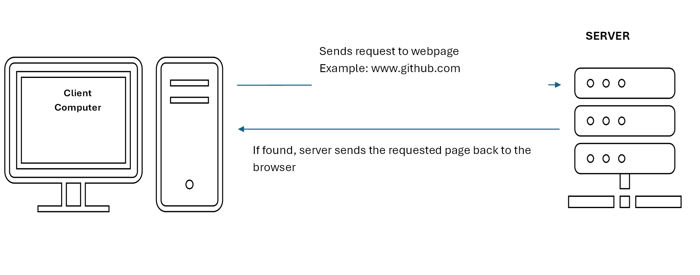

# Syntax Basics and Types

## How websites are rendered

## How do we add JavaScript to our page?
You have multiple options to add JavaScript to your page, including inline as well as in a separate document much like CSS.

### In the head tag of your HTML

### In the body tag of your HTML

### In a separate file (like CSS)

## Variables
There are 3 ways to define variables in JavaScript (let, var, const). 

**var** (Note: is the traditional way, but is very rarely used anymore.)
    - Scope: var is function-scoped, which means that if you declare it inside a function, it is only accessible from within that function. If you declare it outside a function, it becomes a global variable.
    - Re-declaration: You can re-declare a var variable in the same scope without errors.

**let**
    - Scope: let is block-scoped. This means it is only accessible within the block (e.g., {}) where it is defined, including inside loops and conditionals.
    - Re-declaration: You cannot re-declare a let variable in the same scope without errors.

**const**
    - Scope: const is also block-scoped, like let.
    - Mutability: Variables declared with const cannot be reassigned (i.e., you cannot change the reference to another value), but if the variable hols an object, you can still mutate the object's properties.

See [Examples](./01-syntax-basics-and-types.js)