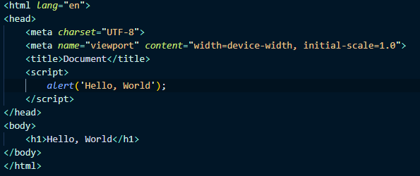
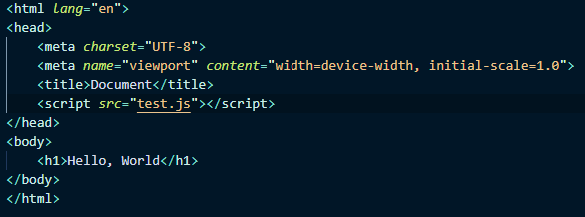

# Syntax Basics and Types

## How websites are rendered

## How do we add JavaScript to our page?
You have multiple options to add JavaScript to your page, including inline as well as in a separate document much like CSS.

### In the head tag of your HTML

### In the body tag of your HTML

### In a separate file (like CSS)

