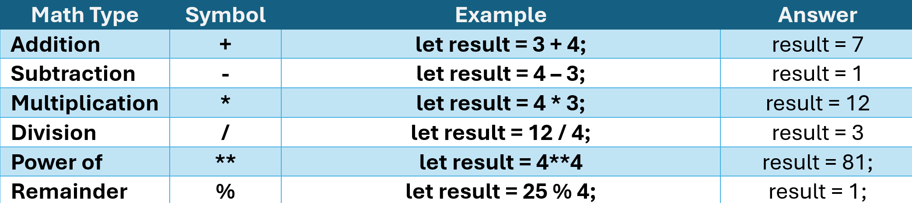
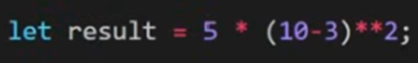

## Variables
There are 3 ways to define variables in JavaScript (let, var, const). 

**var** (Note: is the traditional way, but is very rarely used anymore.)
    - Scope: var is function-scoped, which means that if you declare it inside a function, it is only accessible from within that function. If you declare it outside a function, it becomes a global variable.
    - Re-declaration: You can re-declare a var variable in the same scope without errors.

**let**
    - Scope: let is block-scoped. This means it is only accessible within the block (e.g., {}) where it is defined, including inside loops and conditionals.
    - Re-declaration: You cannot re-declare a let variable in the same scope without errors.

**const**
    - Scope: const is also block-scoped, like let.
    - Mutability: Variables declared with const cannot be reassigned (i.e., you cannot change the reference to another value), but if the variable hols an object, you can still mutate the object's properties.

### Numbers

**Order of Operation - BIDMAS**
    - **B**rackets
    - **I**ndices
    - **D**ivision
    - **M**ultiplication
    - **A**ddition
    - **S**ubtraction

1. Brackets first
    10 - 3 = 7
2. Indices (Squared)
    7**2 = 49
3. Multiply (As there is no division)
    5 * 49 = 245
### Arrays
Arrays are useful for storing collections of like data such as a list of users or my children.

Arrays can store any type of data (string, number, arrays), and each item in the array can be of a different data type.

To access a certain item in an array you use it's array position starting from 0.

### Booleans
Booleans allow for conditions to be met and return either a true or false value.

See [Examples](02-variables.js)
