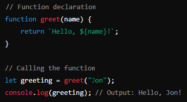

## Functions

In JavaScript, a function is a block of code designed to perform a particular task. Functions can be defined using the function keyword, arrow syntax, or the Function constructor. They can also be called more than once, to perform the same task multiple times. Here's an example of defining a function using the traditional function keyword:

### Explanation

**Function Declaration** 
The function ***greet*** is declared with one parameter, ***name***.

**Function Body**
Inside the function, we use a template literal to return a greeting message that includes the ***name*** passed as an argument.

**Function Call**
The function is called with the argument ***"Jon"***, and the returned value is stored in the variable ***greeting***.

**Output**
The greeting message is then logged to the console.

See [Examples](04-functions.js)

