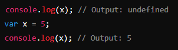
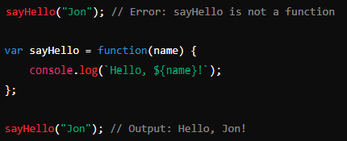

## What is Hoisting in JavaScript?
Hoisting is a behavior in JavaScript where variable and function declarations are moved ("hoisted") to the top of their containing scope during the compilation phase, before the code is executed. This means you can use variables and functions before you declare them in the code. However, only the declarations are hoisted, not the initializations or assignments.

## Variable Hoisting
When you declare a variable with var, the declaration is hoisted to the top of its scope (either the global scope or the function scope). However, the initialization (if any) remains in place. As a result, the variable is accessible before its declaration but will be undefined until the point where it is assigned a value.

### Example of Variable Hoisting:

## Function Hoisting
Functions declared using the function keyword (known as function declarations) are also hoisted to the top of their scope. This means you can call the function before it is defined in your code, and it will still work.

### Example of Function Hoisting:

Here, the function greet is hoisted, so you can call it before the actual function code appears.

## Function Declarations vs. Function Expressions
### Function Declarations:

**Definition:** A function declaration defines a named function using the function keyword.
**Hoisting:** The entire function declaration (including the function body) is hoisted to the top of the scope.

### Function Expressions:

**Definition:** A function expression defines a function as part of an expression. This can be anonymous or named, and it's often assigned to a variable.
**Hoisting:** Only the variable declaration (if any) is hoisted, not the function definition. This means the function is not available until the code execution reaches the assignment.

### Example of Function Expression:

In this example:

The declaration var ***sayHello*** is hoisted, but the function assignment ***function(name) {...}*** is not.

When you try to call ***sayHello*** before the function is assigned, you get an error because at that point, **sayHello is undefined.**

### Why the Difference?
Function Declarations are hoisted in their entirety, so the function can be used before it is declared. This is because the JavaScript engine registers the function at the top of the scope during the compilation phase.

Function Expressions are treated like regular variable assignments. The variable itself is hoisted, but the assignment (which is the function definition) is not. This means the function is only available after the assignment is executed.

### Summary
- Hoisting in JavaScript moves declarations to the top of their scope, but not the assignments.
- Function Declarations are fully hoisted, allowing you to use the function before it's declared in your code.
- Function Expressions are not hoisted in the same way; only the variable declaration is hoisted, not the function assignment. - - - 
- Therefore, the function is not accessible until the code reaches the assignment.
- This distinction is crucial to understand how and when functions are available in your code, ensuring you avoid unexpected errors related to hoisting.