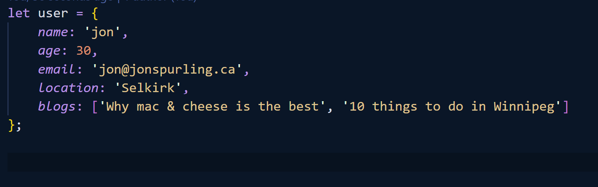
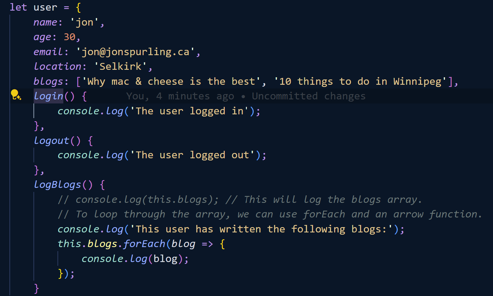

## Objects
Objects in real life have properties & things they can do...

### Properties

A ***phone*** is a real object, it could have ***properties and things***.

| PROPERTIES | THINGS IT CAN DO |
|-----------:|------------------|
| Colour     | Ring             |
| Size       | Take a picture   |
| Model      | Play music       |

You could have a ***user-object***, with the following ***properties and methods***

***Methods*** remember are just something that happens (a function) but you use dot notation to access the properties. 

| PROPERTIES | THINGS IT CAN DO |
|-----------:|------------------|
| Email      | Login            |
| Username   | Logout           |
| Gender     |                  |

***Blog Post***

| PROPERTIES | THINGS IT CAN DO |
|-----------:|------------------|
| Title      | Publish          |
| Content    | Unpublish        |
| Author     | Delete           |

### Object Literal Notation
To create an object literal, you create a variable, and use { } to add properties using key/value pairs. Such as name: "John".
For readability, it is nice to separate each key/value pair on a different line. 

### Dot Notation
If we want to access one of the properties, we can use dot notation. (Ex: console.log(user.name))
If you want to update a property on an object, you use dot notation as well. (Ex: user.age = 35)

### Bracket Notation
You can also use bracket notation like you are trying to access an array, but using the key as your value. (Ex: console.log(user['name']))
And change the values doing the same. (Ex: user['age'] = 100)

You can also create a variable and pass it into the bracket notation.

### Adding methods to our objects
To add a function to an object, you use a key, value pair still. However, the value is a function. So to access it you would use dot notation to call the method.

### This keyword
When we add the this keyword to a function within an object, it refers back to the object itself. Using dot notation you can then use this.blogs for example to access the blogs property of the object.

**What is this?**
This is a context object, and it represents the context how the current code is executed. If we use this, in the root of the document it will represent the global context. The global object in JavaScript is called a Window Object. If we use the this keyword within the function inside the object, it will refer to the user object.

**Whats happening here?**
When we use this inside a method, JavaScript sets the this keyword to be the object the method was used on.

To use this inside a method on its own ('this'), you must use a regular function. However, you can modify the property in the object so that it's a little shorter/easier to type.

See [Examples](05-objects.js)

