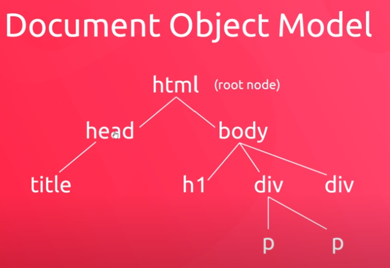

## JavaScript & the DOM

In this chapter, you really get to see what JavaScript is about and start manipulating the DOM. In this chapter you will learn to:

- add content to the browser
- change CSS styles
- react to user events (e.g clicking)
- cool effects like popups

### DOCUMENT OBJECT MODEL (DOM)
**What is it?**
It's created by the browser, and it's called the ***'document'*** object. So if we want to change something on the web page, we just interact with the ***'document'*** object.

In a browser, if you go into the console in developer tools, and type document, you are going to see a visual representation of the html page. We can expand them and go inside them. There's a ton of properties assosiated with the ***'document'*** object, and if you use dot notation (add a . to the end of ***document.***) it will show you all of them.

The document describes are html page as a hierarcial tree of nodes. If you think of an html page it has a whole bunch of tags. At the beginning we have an html page (root node). Then we have a head and body node. Under those we could branch off to title node and h1, div to p, or just div.

### ADD/CHANGE/REMOVE CONTENT
The first step to add, change or remove content, you need to select what content you want to alter. Then you need to reach in, and get a reference on the element. This is known as querying the dom.

The second step is when we actually do something, like change its content. We can do this using a few methods attached to document such as:

- querySelector('css-selector'); -> This will select the first element that matches the targeted css selector.
- querySelectorAll('css-selector'); -> This one will get all the tags that you have targeted with the css selector.
**NOTE**: These are the recommended ways to grab an element. The other ways are possible if needed.

### Other Ways
These other ways are older ways of doing it, but still may be useful at times. 

**getElementById('page-title')**
Pulls a single value from the element with an ID of page-title

**getElementsByClassName('error')**
Pulls multiple values from the document that have a class name of *"error"*.

**getElementsByTagName('p')**
Pulls all the p tags from the document.

All these must should be stored in a variable.

### MAKE A COOL POP-UP EFFECT IN THE WEB PAGE
**How to change the text & html inside elements**
To change the text inside an element, you would grab the element using a querySelector or other method, and use .innerText to change or append.

For example:
    error.innerText = "this is the error message"; // This will change the error message entirely of a single element.
    error.innerText += "this is additional text"; // This will append to the original error elements inner text.

**Changing the HTML**
To change the HTML inside an element you would grab the element using another querySelector or other method, and use .innerHTML to change or append new HTML.

For example:
    error.innerHTML = "
BE WARE
"; // New HTML
    error.innerHTML += "
Oh, and this would be appended.
"; // This would get appended because we used the += operator.

**Changing element attributes**
We need to get a reference to the element so we would use a querySelector and store it in a variable.
We can use the .getAttribute('href') to target the a tag in the index.html.
To change an attribute, you can use the .setAttribute('what you want to change', 'the information your changing to');
Using .setAttribute, you can also set styles by using 'style' for what you want to change, and then giving the 'color: green' or other css style.

There is one drawback to using .setAttribute to the style. If we want to add another style to it, it will override instead.
To prevent this in JavaScript by using the ***style*** property. (console.log(title.style))

If you are ever unsure about a style property go to console in developer tools and look through the list.

See [Examples](06-javascript-and-the-dom.js)

